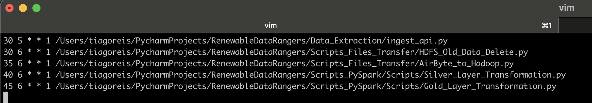

# DataEng_Proj_ODS_7
This is the final project for ISEP Post-Graduation in BigData

# Course Subject: Seminar
# Data project name: Renewable Data Rangers

# All the info about this project is being published on this Blog:
https://rdatarangers.blogspot.com/

# Project Description

# Team Members
- [Tiago Reis](https://github.com/Tiago-B-C-Reis)
- [Nelson Moreira]()

# Hands-on Project: Renewable Data Rangers
## Dev Architecture:

## Prod Architecture:

# Hadoop Ecosystem docker image:
https://github.com/Marcel-Jan/docker-hadoop-spark/tree/master

# CronTab:

## CronTab scripts are scheduled by taking in account that the AirByte connection runs at 00:06:00 every monday:

# Notes:
## Amazon Redshift:
- The Amazon Redshift warehouse is not up due to cost constraints.
## Orchestration:
- The project has the Airflow orchestrator, but it is not being used due to the fact that the DAGS are yet not complete and the project is also not yet in production.
- Instead, we are temporarily using the Python CronTab to run the schedule code and the scripts.
## Exploration/ML:
- The exploration and ML part of the project is not yet complete.
## Monitoring and DataOps:
- The monitoring and DataOps part of the project is not yet complete.